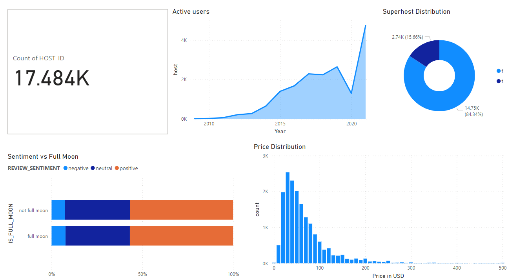
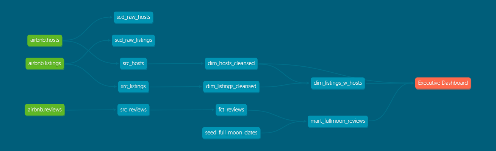

# 🏠 dbt Project: Airbnb Data Modeling with Snowflake


Welcome to this **dbt** project, which demonstrates how to model **Airbnb** data in a **Data Warehouse** environment using **Snowflake**. 

This setup is inspired by:

- The [**jaffle_shop**](https://github.com/dbt-labs/jaffle_shop) example project, which outlines a simple pattern for staging, transforming, and analyzing data.
- The Udemy course [**Complete dbt (Data Build Tool) Bootcamp: Zero to Hero**](https://www.udemy.com/course/complete-dbt-data-build-tool-bootcamp-zero-to-hero-learn-dbt/), created by the **dbt Learn Team**.

# Dashboard
The dashboard below was built to communicate the following insights and metrics for Airbnb Product and Go-To-Market Executives:
- Review Sentiments by season - full-moon vs non-full moon (Horizontal Stacked Bar Chart)
- Frequency Distribution of SuperHost (Donut Chart)
- Active Users by Year (Line Chart)
- Price Distribution (Bar Chart)



# dbt Airbnb Data Transformation Project

This repository hosts a dbt (data build tool) project designed to transform raw Airbnb data into a structured and analyzable format. The project leverages staging models and advanced SQL transformations to create reliable and insightful datasets, ready for business intelligence and analytical reporting.

## 🌟 Features

* **Staging Layer**: Raw data is first ingested into a dedicated staging layer, ensuring data cleanliness and consistency before further transformations.

* **Advanced SQL Transformations**: Implements complex SQL logic, including aggregations, window functions, and data cleaning, to derive meaningful metrics and dimensions.

* **Modular Design**: Organized into distinct dbt models (staging, intermediate, and final marts) for maintainability and scalability.

* **Data Testing**: Includes dbt tests to ensure data quality and integrity at various stages of the transformation pipeline.

* **Documentation**: Automatically generated dbt documentation provides a clear overview of all models, their lineage, and definitions.

## 📁 Project Structure

The project follows a standard dbt structure:
```
.
├── models
│   ├── staging             # Raw data clean-up and type casting
│   │   ├── stg_airbnb_calendar.sql
│   │   ├── stg_airbnb_listings.sql
│   │   ├── stg_airbnb_reviews.sql
│   │   └── ...
│   ├── intermediate        # Intermediate transformations, feature engineering
│   │   ├── int_daily_occupancy.sql
│   │   └── ...
│   └── marts               # Final data marts for consumption
│       ├── core
│       │   ├── dim_listings.sql
│       │   ├── dim_hosts.sql
│       │   ├── fct_reviews.sql
│       │   └── fct_bookings.sql
│       └── agg
│           ├── agg_daily_metrics.sql
│           └── ...
├── analyses                # Ad-hoc analytical queries
├── macros                  # Reusable SQL logic
├── seeds                   # Static data (e.g., lookup tables)
├── tests                   # Custom data quality tests
├── dbt_project.yml         # Project configuration
└── profiles.yml            # (Local) Database connection configuration
```

## 📊 Data Models Overview (Conceptual)

The project aims to build a comprehensive data model for Airbnb data, structured into several layers. Below is a visual representation of the data flow and data 

### Staging Models (`models/staging`)

These models are the first layer of transformation, directly querying raw source data. Their primary purpose is to:

* Standardize column names.

* Apply basic data type conversions.

* Filter out irrelevant records.

* Ensure a consistent `id` field.

*Examples:*

* `stg_airbnb_listings`: Cleans and selects relevant columns from raw listings data.

* `stg_airbnb_reviews`: Processes raw reviews data.

* `stg_airbnb_calendar`: Handles calendar-specific raw data.

### Intermediate Models (`models/intermediate`)

This layer performs more complex, often multi-source, transformations and feature engineering.

* `int_daily_occupancy`: Calculates daily occupancy rates based on calendar and booking data.

### Mart Models (`models/marts`)

The final layer, designed for direct consumption by BI tools or data analysts. These are typically dimensional and fact tables. Below is simplified visual of the dbt dag:


*Examples:*

* **Dimensions:**

  * `dim_listings_cleansed`: Contains unique listing attributes.

  * `dim_hosts_cleansed`: Details about hosts.

* **Facts:**

  * `fct_reviews`: Fact table for individual reviews, linked to listings and hosts.

  * `fct_bookings`: Aggregated booking information. (Not included in the model)

  * `agg_daily_metrics`: Daily aggregated metrics (e.g., average price, number of bookings) - (Not included in the model)

## 🚀 Getting Started

### Prerequisites

Before you begin, ensure you have the following installed:

* **Python 3.8+**: [Download Python](https://www.python.org/downloads/)

* **dbt-core**: Install via pip: `pip install dbt-core dbt-[your_database_adapter]` (e.g., `dbt-postgres`, `dbt-snowflake`, `dbt-bigquery`).

### 1. Clone the Repository

git clone https://github.com/your-username/your-airbnb-dbt-project.git
cd your-airbnb-dbt-project


### 2. Set Up a Python Virtual Environment (Recommended)

python -m venv venv
source venv/bin/activate  # On Windows: `venv\Scripts\activate`


### 3. Install dbt Dependencies

pip install dbt-core dbt-snowflake # Replace dbt-snowflake with your database adapter


### 4. Configure `profiles.yml`

dbt uses a `profiles.yml` file to connect to your data warehouse. You'll need to create or update this file in your `~/.dbt/` directory.

Here's an example `profiles.yml` for a Snowflake connection (adjust for your specific data warehouse):

`~/.dbt/profiles.yml`
```
airbnb_dbt: # This is the profile name, referenced in dbt_project.yml
  target: dev
  outputs:
    dev:
      type: snowflake
      account: <your_account_identifier>
      user: <your_username>
      password: <your_password> # Consider using environment variables for sensitive info
      role: <your_role>
      database: <your_database>
      warehouse: <your_warehouse>
      schema: dbt_your_username # Your development schema
      threads: 4
      client_session_keep_alive: False
```


**Note**: For sensitive credentials, it's highly recommended to use environment variables instead of hardcoding them in `profiles.yml`.
Example:

      user: "{{ env_var('DBT_SNOWFLAKE_USER') }}"
      password: "{{ env_var('DBT_SNOWFLAKE_PASSWORD') }}"


### 5. Verify Your dbt Setup

Run `dbt debug` to ensure dbt can connect to your data warehouse:

dbt debug --profile airbnb_dbt # Use the profile name defined in profiles.yml


## 🏃 Running the Project

### 1. Seed Static Data (if applicable)

If your project includes seed files (.csv files in the seeds directory), load them into your data warehouse:

dbt seed


### 2. Run the dbt Models

This command will execute all the SQL models in your project, creating or updating tables/views in your data warehouse:

dbt run


You can run specific models or groups of models:

* Run only staging models: `dbt run --select models/staging`

* Run only a specific model: `dbt run --select dim_listings`

* Run a model and its downstream dependencies: `dbt run --select dim_listings+`

### 3. Test Your Data

Execute the defined data quality tests:

dbt test


### 4. Generate and Serve Documentation

Generate a static website containing your project's documentation, lineage graphs, and model definitions:

dbt docs generate
dbt docs serve


After `dbt docs serve`, open your web browser to the URL provided (usually `http://localhost:8080`).

## ✍️ Contributing

Contributions are welcome! Please feel free to open an issue or submit a pull request.

1. Fork the repository.

2. Create your feature branch (`git checkout -b feature/AmazingFeature`).

3. Commit your changes (`git commit -m 'Add some AmazingFeature'`).

4. Push to the branch (`git push origin feature/AmazingFeature`).

5. Open a Pull Request.

## 📄 License

This project is licensed under the MIT License - see the [LICENSE](LICENSE) file for details
```
