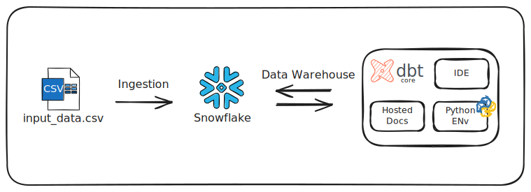

# 🏠 dbt Project: Airbnb Data Modeling with Snowflake



Welcome to this **dbt** project, which demonstrates how to model **Airbnb** data in a **Data Warehouse** environment using **Snowflake**. 

This setup is inspired by:

- The [**jaffle_shop**](https://github.com/dbt-labs/jaffle_shop) example project, which outlines a simple pattern for staging, transforming, and analyzing data.
- The Udemy course [**Complete dbt (Data Build Tool) Bootcamp: Zero to Hero**](https://www.udemy.com/course/complete-dbt-data-build-tool-bootcamp-zero-to-hero-learn-dbt/), created by the **dbt Learn Team**.

The project follows best practices for:

1. **Data Loading**: Ingesting CSV data into Snowflake.
2. **Staging**: Creating **staging** models to clean and prepare raw data.
3. **Transforming**: Building **intermediate** and **mart** layers to enrich and aggregate data.
4. **Analyzing**: Leveraging **dbt** to easily manage models, run tests, and generate documentation.

---

## 📖 Overview

The goal of this project is to:

1. Ingest Airbnb data from a CSV file into Snowflake.
2. Transform raw data into analytics-friendly models using dbt.
3. Provide dimensional models (dimensions, facts) that can be easily queried and analyzed.

Key components include:

- **Raw Data**: Sourced from CSV files (e.g., `input_data.csv`).
- **Snowflake**: Serves as the data warehouse to store both the raw data and transformed models.
- **dbt (Data Build Tool)**: Handles data transformations, testing, and documentation within Snowflake.

This README outlines how everything is structured, following a simplified approach similar to **jaffle_shop**.

---

## 🏗 Project Structure

The project is organized into several types of dbt models:

- **Source Models (`src_*.sql`)**  
  These models define your data sources (CSV files loaded into Snowflake). They provide a clear reference for all your raw data tables.

- **Staging Models (`stg_*.sql`)**  
  Inspired by **jaffle_shop**, these models clean and unify data from the source layer. They typically handle tasks like:
  - Renaming or casting fields.
  - Filtering out invalid records.
  - Standardizing date formats and keys.

- **Dimension Models (`dim_*.sql`)**  
  These are transformations of your staged data into dimensions, holding descriptive attributes. For example, `dim_hosts_cleansed.sql` represents cleansed and standardized information about Airbnb hosts.

- **Fact Models (`fct_*.sql`)**  
  These models aggregate data into tables optimized for analytics. Fact models often contain metrics or measures (e.g., a reviews fact table that stores review counts, ratings, etc.).

- **Intermediate/Join Models (`dim_listings_w_hosts.sql`)**  
  When you need to combine data from multiple dimensions (e.g., listings with their corresponding hosts), these models serve as an intermediate step, making further analysis simpler.

---

## 📂 File Summary

Below is a quick guide to the primary SQL models:

- `src_hosts.sql` — Defines the source of host data (raw form).
- `src_listings.sql` — Defines the source of listing data (raw form).
- `src_reviews.sql` — Defines the source of review data (raw form).
- `dim_hosts_cleansed.sql` — Cleans and transforms host data.
- `dim_listings_cleansed.sql` — Cleans and transforms listing data.
- `dim_listings_w_hosts.sql` — Joins listings and hosts for broader context.
- `fct_reviews.sql` — Provides an aggregated fact table of reviews.

---

## ⚙️ Data Pipeline

1. **Ingest CSV Data into Snowflake**  
   - Upload or load your `input_data.csv` into a Snowflake table (e.g., `RAW_AIRBNB_DATA`).
   - Create external stages or use Snowflake’s load methods (e.g., `COPY INTO`) to bring the data into your environment.

2. **Build dbt Models**  
   - Source models (`src_*.sql`) reference the loaded raw data in Snowflake.
   - Staging models (`stg_*.sql`) transform and clean this data according to best practices from **jaffle_shop**.
   - Dimension and fact models (`dim_*.sql`, `fct_*.sql`) organize the data into analysis-ready tables.

3. **Analyze and Visualize**  
   - Once your models are materialized in Snowflake, use BI or data visualization tools (e.g., Looker, Tableau, or Mode) to analyze your Airbnb metrics and KPIs.

---

## 🚀 Getting Started

### Prerequisites

1. **Snowflake** account with the necessary warehouse and database.
2. **dbt** installed (CLI or Cloud version).
3. A configured `profiles.yml` to connect dbt to your Snowflake environment.

### Quickstart

1. **Clone** this repository and navigate into the project directory:

   ```bash
   git clone https://github.com/your-account/airbnb-dbt-snowflake.git
   cd airbnb-dbt-snowflake
   ```

2. **Install** dbt dependencies:

   ```bash
   pip install dbt-snowflake
   ```

3. **Run** dbt commands:

   ```bash
   dbt deps
   dbt seed
   dbt run
   dbt test
   dbt docs generate
   ```

## 🔨 Customization & Inspiration

- **Adapt to Your Data**: While this project focuses on Airbnb datasets, you can customize the staging, dimension, and fact models to fit any CSV-based data.
- **Inspired by jaffle_shop**: Check out [**jaffle_shop**](https://github.com/dbt-labs/jaffle_shop) to see how the dbt-labs team organizes source, staging, and modeling layers. It’s a great starting point for any new analytics project.
- **Modular & Reusable**: Because each stage is decoupled, you can easily swap out or update specific models without affecting the rest of the pipeline.

## 📄 Additional Resources

- [dbt Documentation](https://docs.getdbt.com/)
- [Snowflake SQL Reference](https://docs.snowflake.com/en/sql-reference/)
- [jaffle_shop on GitHub](https://github.com/dbt-labs/jaffle_shop)

## ⚖️ License

This project is licensed under the [MIT License](LICENSE). Feel free to use and adapt any part of this project in your own data workflows.
